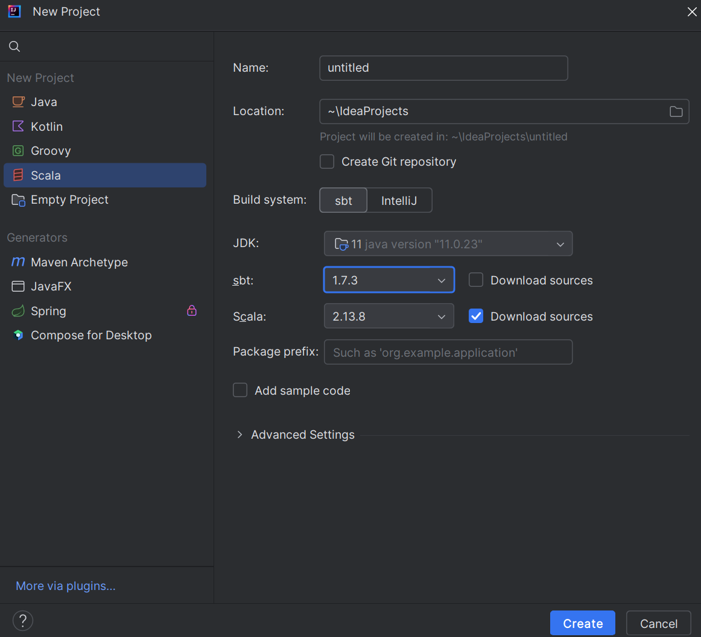
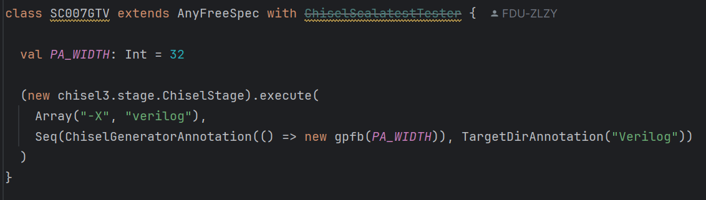
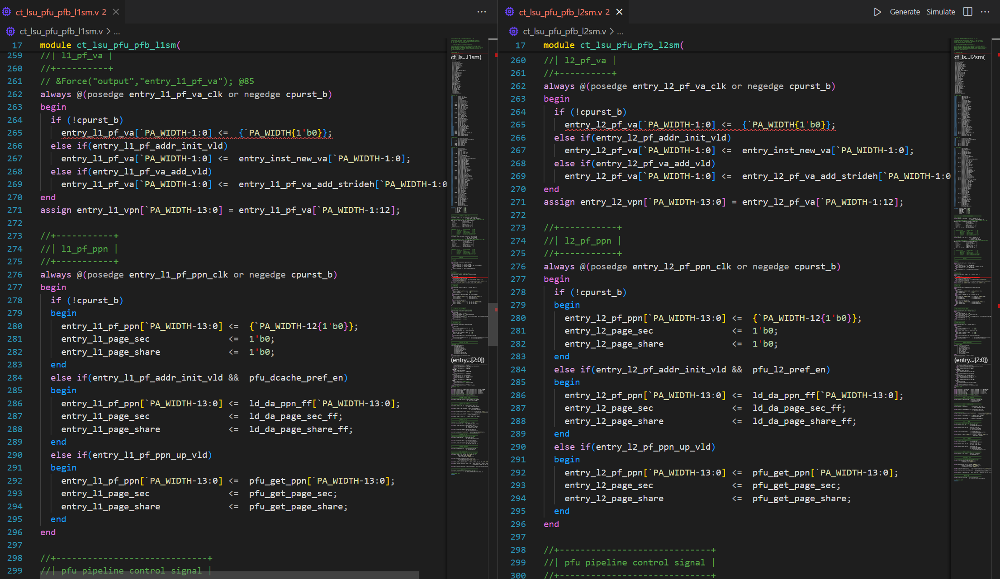
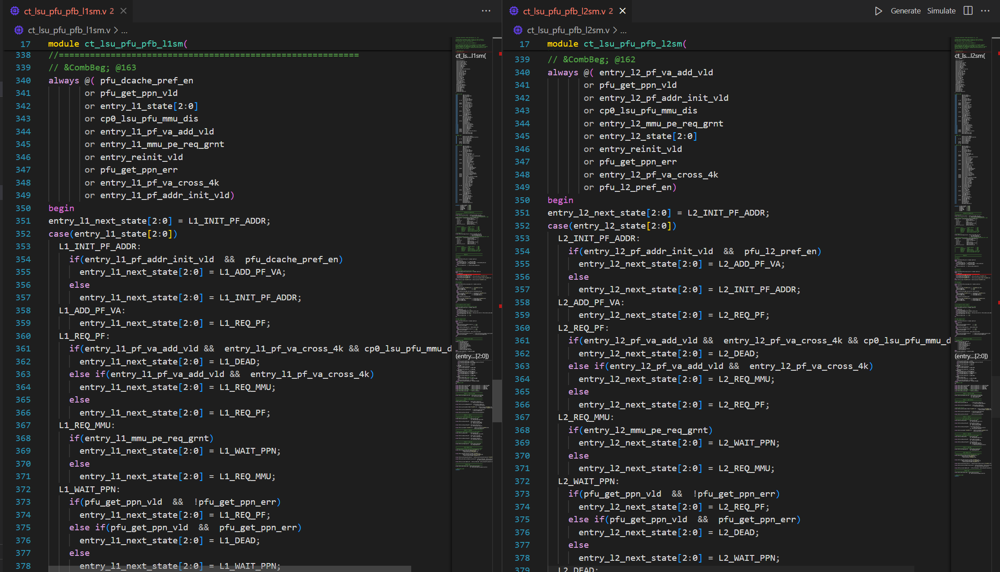
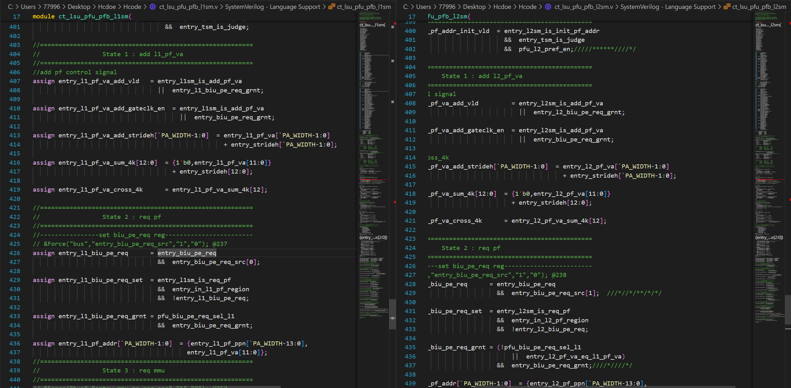
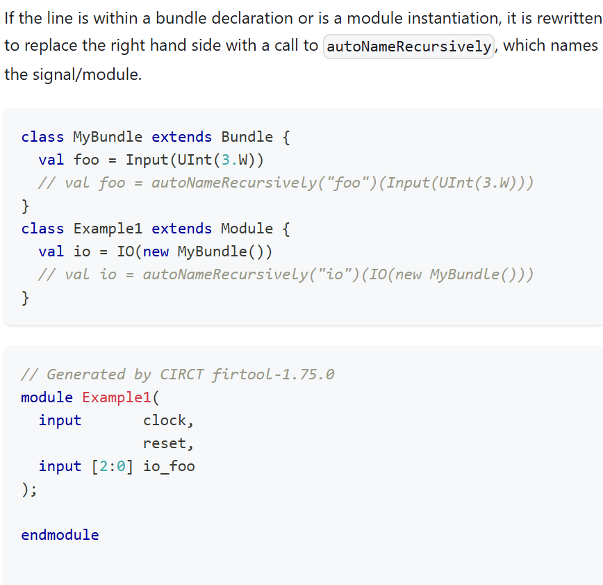
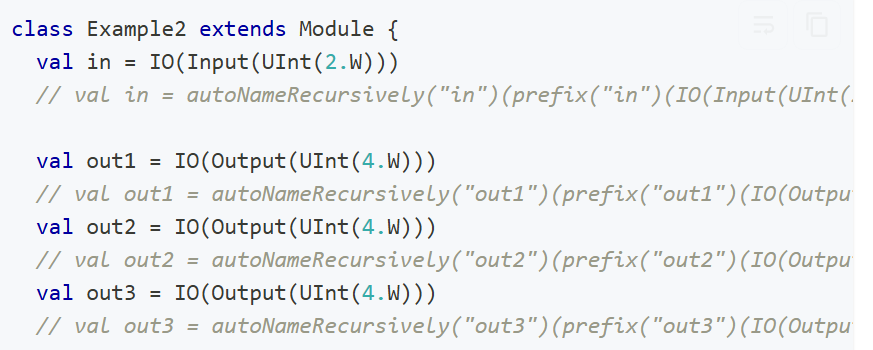
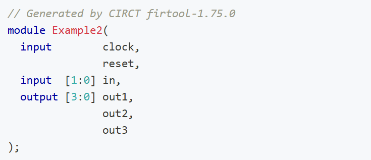

# Chisellize C910 gpfb
按复旦大学嵌入式H的要求，自学了chisel并学习了C910数据预取的gpfb模块，其含有gpfb,l1sm,l2sm,tsm以及gated_clk模块

对其verilog源码实现了chisel化，并成功发射成为verilog代码，目前完成了各个模块的分别测试，有的coremark分更高了，有的更低了，有的还需要优化

## 环境配置
课程给的虚拟环境运行在个人电脑上会出现卡顿等问题，而且文件传输和交流非常麻烦，不利于提高chisel化效率。我们上网搜索和学习了如何在Win环境下使用IDEA并实现写chisel和发射verilog
1. 下载IDEA社区版本，免费
2. 下载JDK11，因为这个版本比较稳定，我没试其他的版本，需要去官网下载，之前用了22版本会有一些奇怪问题
3. 一定要指定好scala版本，要和需要的chisel版本以及sbt构建文件指定的版本适配。

这是截取的可用配置
    
4. github克隆一个template，在sbt构建一下就OK
5. 发射为verilog:只需要替换new后面模块名字，并且val PA_WIDTH可以任意删除，只是示例

## chisel化过程中一些学习
1. 时钟域：可以使用一个withClockAndReset块内声明所有和单个时钟相关的寄存器，接收块返回值。之后该寄存器和外部时序逻辑混用
2. 对于chisel不支持部分位赋值的问题：chisel支持位选读的写法，但不支持位选写的写法。我觉得其实没有问题，verilog使用位选写的语法，如果是wire类型，那么没有提及的
   位其实被认为是高阻态了。我们可以在chisel中直接实现在端口定义的时候就参数化，位选的宽度直接声明端口的时候就做好。（但其实我在chisel过程中没有这么做，而是对于没有提及的位用了补0的手段，实现方法是用的 ## 拼接）
   1. 使用vec实现部分赋值
   2. 使用##进行赋值
   3. 使用掩码进行部分赋值
3. 模块名：使用了override def desiredName: String = s"ct_lsu_pfu_pfb_l${chose+1}sm"，用到了scala的字符串插值语法，实现了例化两个l1sm的时候，根据参数生成不同模块名的实例
4. **参数化生成不同的模块**：个人认为在实现chisel过程中最能展现chisel强大的一处！根据对l1sm和l2sm的分析，两者的逻辑有大量的重合，仅仅在部分端口名字和信号连接上面有不同。针对这种情况，两种解决方法
    1. 先写一个基础模板，将所有相同的逻辑写上去，然后l1sm和l2sm都继承基础模板，再重写相关的端口名字和部分不同的逻辑
    2. 写一个综合模板，根据输入的参数不同生成不同的模块，**我就是用这种方法**。首先写了一个l1sm的综合模块，根据传入的参数chose来决定生成什么样的模块
5. 可有可无的端口问题：一般出现在参数化生成模块的情景中。综合模板为了根据参数生成不同模块，需要对端口和逻辑进行可选化设计。使用scala的some语法，使用到该端口时候要用get获取。（网上说也可以用0位宽，但是0位宽是
   生成verilog可以对一些0位宽端口优化，但是chisel的连接逻辑会有问题）
6. 快速模块例化与端口连接：
    1. 对于相同的模块例化，直接VecInit(Seq.fill(...))来例化多个相同模块，然后相同模块直接<>快速连接。
    2. 对于不同的模块例化，如果模块逻辑和结构比较相近。
        1. 对于相同功能的端口用一个Bundle，然后<>连接这部分端口。对于结构和逻辑不同端口再手动连接(也可以所有的端口都在一个Bundle,但是几个相同的端口用List或者Bundle再包一层)
        2. 几个模块一起打包为List，用for对相似逻辑一起连接，if对不同端口不同操作
    3. 端口用一个Bundle打包，然后Bundle使用.asUInt转化，转化之后再统一赋值。注意端口方向和位宽，同时每个想要连接的信号在Bundle里面信号顺序要一致
7. scala和chisel结合体验：控制结构 -> 集合 + 函数编程 -> 面向对象，虚对象虚方法等。此前没有学过面向对象编程，目前面向对象的一些术语，如特质，虚方法，重定义等不太懂，面向对象的精髓用的不多

## 个人觉得最妙的chisel化改进例子：l1sm与l2sm的结合：

### 相似之处：

### 不同之处：（注意绿色标记的地方）

此外还有一些，不贴图了

经过仔细分析发现，只有组合逻辑有区别，其次就是换了个信号名字罢了。于是接下来只分析有区别的组合逻辑信号，将l1sm和l2sm
套在一个模块里面，通过指定参数chose即可

->跳转源码分析

再去看gpfb顶层连线，发现有一点点非常难发现的问题：l1sm的entry_l1_pf_va在l2sm中也有，并且还是一个input一个output，在顶层模块里面直接对连了。分析里面的逻辑发现：

## TODO：优化想法
1. 可以将assign等赋值语句用list.map实现，如将相似的与门assign左侧装到一个list，右侧装到一个list，再对左侧list.map
2. 在对state参数进行定义时，使用了chiselEnum的语法，但是和reg一起使用会有很多奇怪报错，主要在于类型问题，chisel中这方面经过调试可以跑，但类型匹配还没懂，建议可以用List等

## chisel化综合体验：
一开始还是挺费解难学的，后来发现其实能用到的也不多，大部分还是搬砖，觉得这个verilog转为chisel很难完全展现chisel的强大之处，毕竟chisel才是更高的语言，如果一开始就用chisel
设计一个大的模块我觉得更有意思。学习体验大概就是:

掌握chisel基本硬件和数据类型等->掌握verilog时序与组合逻辑和chisel实现不同之处->开始搬砖，搬砖过程中费劲心思搞点chisel和scala特性
如控制结构，集合，函数，实现参数化等，还有一些mux等帮助快速实现的chisel硬件

## 发射为verilog并跑分问题记录与学习
1. 端口名问题：当发射为verilog的时候，模块端口名字会被自动带上io_等情况
   1. 分析:我翻阅了chisel的cookbook，个人觉得是这样的意思:
   
    以下是cookbook的例子：
    
    **对于有Bundle的情况**：
        
    可见结果有io_
    
    **而对于无Bundle的情况**
    
    
    可见结果无io_
    个人看他的意思是：Bundle内部声明并赋值的时候加了一个前缀，这个前缀就是我们要的端口名字，而当val io=IO(...)的时候，又会加一个前缀，这个就是可恶的io_
    但是如果我们的赋值和声明不用Bundle,就不会有可恶的io_了。中间变量应该也是一样，因为在嵌入到系统进行仿真的时候这个不是有影响的问题，我没深入分析，应该一样的
    
    2. **解决方法：**
       1. 加一个掩层，掩层的端口名字不带io_，掩层和生成的顶层verilog文件进行端口连接就可，用vim或者正则表达式替换一下非常快
       2. 顶层不要用Bundle，全部用val a = IO(Input(Bool()))类似的形式来例化，我觉得太笨了，不过也可以用一些trick，比如for,list.map等看起来正常一些，但还是觉得苯
       3. 用awk将生成的所有输入输出端口的io_去掉，但是有风险，可能会导致一些信号名字被错误处理，导致逻辑问题
       4. 用noprefix，这是我看到的一个去除前缀的方法，但是所有的例子针对中间变量，官方也没有相关的示例，我试了不行，不知道谁有对这个东西的更深理解
       5. 不知道有没有这种方法：通过指定发射成verilog的时候指定要求，让他端口不要加前缀。我觉得这个是最好的解决方法，但是翻看了很多网站也没有说这方面解决方法。

很奇怪的是，官方竟然对于这个Bundle+IO例化端口名字如何去除io_没有任何例子，可能是我们这个问题太奇怪了，写好的verilog转chisel,可能官方也没有想到会有这种问题。
2. 端口被优化问题：发射为verilog时，一些冗余逻辑被优化。我觉得很正常也很好的功能，但是当我们需要嵌入到系统中做仿真跑分的时候就非常不友好了。

    1. 没有找到相关的解决方法，希望有一种编译的时候指定选项是否优化模块输入输出端口
   2. 从此可见，C910的代码在一定程度上很奇怪，有冗余设计，而且这种冗余设计及其不合理。就在gated_clk里面
   3. 我最后用黑盒例化了gated_clk，chisel不会动这个黑盒，于是和这个关键冗余设计来源的端口就没有被优化了

## C910如何仿真并跑分
见荣誉课文档。我从网上搜索，这个可以在自己电脑上运行，不过第一步要破解VCS和Verdi，有教程，eetop上面好像也有，还是不说了

1. 下载C910官方开源代码
2. 下载相关编译器并解压
3. 修改smart_run里面的setup/example...里面对toolextension的路径
4. 网上随便找个教程，source各种setup
5. 替换自己的代码到genrtl相应位置，同时更改filelist
5. make runcase CASE=hello_world
6. make runcase CASE=coremark

细节见文档或者网上教程